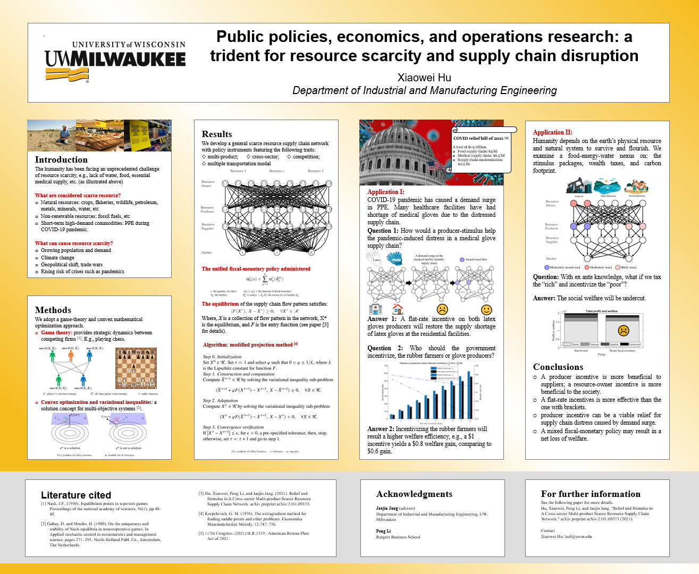

# Public Policies Economics and Operations Research: A Trident for Resource Scarcity and Supply Chain Disruptions 

Below is my contribution to a research poster competition I participated in April, 2021 at UW-Milwaukee. The origianl link can be found [here](http://poster.cae.uwm.edu/poster/sites/default/files/webform/submit_poster/887/poster2021-hu-xiaowei.pdf). 
   

